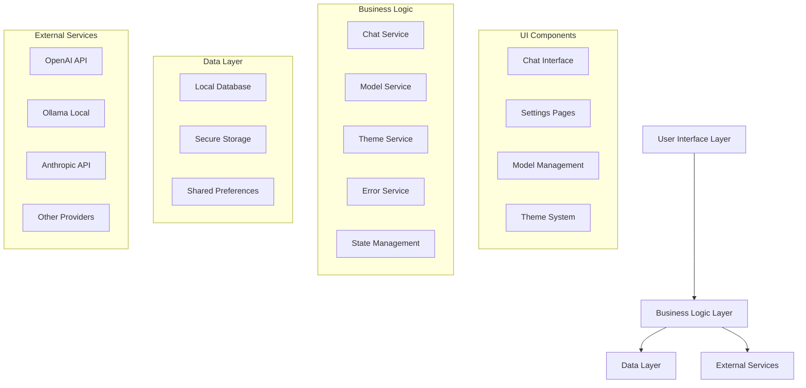

# Design Document

## Overview

This design document outlines the architecture and implementation approach for enhancing the PocketLLM Flutter application. The design focuses on creating a robust, scalable, and user-friendly AI chat application that supports multiple providers, comprehensive error handling, dark mode, and advanced chat features.

## Architecture

### High-Level Architecture



### Service Architecture

The application follows a layered service architecture with clear separation of concerns:

1. **Presentation Layer**: Flutter widgets and UI components
2. **Business Logic Layer**: Services that handle core functionality
3. **Data Access Layer**: Database operations and storage management
4. **External Integration Layer**: API clients for different AI providers

## Components and Interfaces

### Core Services

#### 1. Enhanced Theme Service

```dart
class ThemeService extends ChangeNotifier {
  // Current implementation needs enhancement for:
  // - More comprehensive dark mode colors
  // - Component-specific theming
  // - Accessibility support
  // - Dynamic theme switching
}
```

**Enhancements needed:**
- Add comprehensive color schemes for all UI components
- Implement accessibility-compliant contrast ratios
- Add support for system theme detection
- Create theme presets (dark, light, high contrast)

#### 2. Improved Model State Management

```dart
class ModelState extends ChangeNotifier {
  // Current implementation needs enhancement for:
  // - Real-time synchronization across components
  // - Model validation and health checks
  // - Provider-specific configurations
  // - Fallback model selection
}
```

**Enhancements needed:**
- Implement reactive model synchronization
- Add model health monitoring
- Create provider-specific configuration validation
- Implement automatic fallback mechanisms

#### 3. Enhanced Chat Service

```dart
class ChatService {
  // Current implementation needs enhancement for:
  // - Better error handling and retry logic
  // - Streaming response management
  // - Message queuing for offline scenarios
  // - Response caching
}
```

**Enhancements needed:**
- Implement robust retry mechanisms with exponential backoff
- Add message queuing for offline scenarios
- Create response streaming with proper error handling
- Add conversation context management

#### 4. New Error Handling Service

```dart
class ErrorHandlingService {
  // New service to be implemented for:
  // - Centralized error management
  // - User-friendly error messages
  // - Error logging and reporting
  // - Recovery suggestions
}
```

### UI Components Enhancement

#### 1. Chat Interface Improvements

**Current Issues:**
- Inconsistent dark mode styling
- Limited message interaction options
- No message editing or regeneration
- Poor error state handling

**Design Solutions:**
- Implement comprehensive dark mode color scheme
- Add message context menus (copy, edit, delete, regenerate)
- Create error state components with retry options
- Add message status indicators (sending, sent, error)

#### 2. Model Selection Enhancement

**Current Issues:**
- Model selection not synchronized across components
- No model validation feedback
- Limited provider configuration options

**Design Solutions:**
- Create centralized model selection component
- Implement real-time model status indicators
- Add provider-specific configuration wizards
- Create model testing and validation flows

#### 3. Settings Page Redesign

**Current Issues:**
- Inconsistent styling across settings pages
- Limited configuration options
- No import/export functionality

**Design Solutions:**
- Implement consistent card-based design system
- Add comprehensive configuration options for each provider
- Create settings backup and restore functionality
- Add configuration validation and testing

## Data Models

### Enhanced Message Model

```dart
class Message {
  final String id;
  final String content;
  final bool isUser;
  final DateTime timestamp;
  final MessageStatus status;
  final String? modelId;
  final List<SearchResult>? sources;
  final Map<String, dynamic>? metadata;
  
  // Additional fields for enhanced functionality
  final String? parentMessageId; // For conversation threading
  final bool isEdited;
  final DateTime? editedAt;
  final String? originalContent;
}

enum MessageStatus {
  sending,
  sent,
  delivered,
  error,
  retrying
}
```

### Enhanced Conversation Model

```dart
class Conversation {
  final String id;
  final String title;
  final DateTime createdAt;
  final DateTime updatedAt;
  final List<Message> messages;
  final String? modelId;
  final ConversationSettings settings;
  final Map<String, dynamic>? metadata;
  
  // Additional fields
  final bool isPinned;
  final List<String> tags;
  final int messageCount;
  final DateTime? lastMessageAt;
}

class ConversationSettings {
  final String? systemPrompt;
  final double temperature;
  final int maxTokens;
  final bool webSearchEnabled;
  final Map<String, dynamic> providerSpecificSettings;
}
```

### Enhanced Model Configuration

```dart
class ModelConfig {
  final String id;
  final String name;
  final ModelProvider provider;
  final String baseUrl;
  final String? apiKey;
  final String model;
  final ModelStatus status;
  final ModelCapabilities capabilities;
  final ModelSettings defaultSettings;
  final DateTime lastTested;
  final String? lastError;
}

enum ModelStatus {
  active,
  inactive,
  error,
  testing,
  unknown
}

class ModelCapabilities {
  final bool supportsStreaming;
  final bool supportsImages;
  final bool supportsFiles;
  final bool supportsWebSearch;
  final int maxTokens;
  final List<String> supportedFormats;
}
```

## Error Handling

### Error Classification System

```dart
enum ErrorType {
  network,
  authentication,
  validation,
  rateLimit,
  serverError,
  clientError,
  unknown
}

class AppError {
  final ErrorType type;
  final String message;
  final String userMessage;
  final String? technicalDetails;
  final List<ErrorAction> suggestedActions;
  final DateTime timestamp;
  final String? context;
}

class ErrorAction {
  final String label;
  final VoidCallback action;
  final IconData icon;
}
```

### Error Handling Strategy

1. **Network Errors**: Implement retry logic with exponential backoff
2. **Authentication Errors**: Guide users to API key configuration
3. **Validation Errors**: Show inline validation with correction suggestions
4. **Rate Limit Errors**: Implement queuing with user notification
5. **Server Errors**: Provide fallback options and retry mechanisms

## Testing Strategy

### Unit Testing

1. **Service Layer Testing**
   - Test all service methods with various input scenarios
   - Mock external dependencies (APIs, databases)
   - Test error handling and edge cases
   - Validate state management and notifications

2. **Model Testing**
   - Test data model serialization/deserialization
   - Validate model validation logic
   - Test model transformation methods

### Integration Testing

1. **API Integration Testing**
   - Test all provider integrations with mock servers
   - Validate request/response handling
   - Test streaming response processing
   - Verify error handling for different API responses

2. **Database Integration Testing**
   - Test CRUD operations for all data models
   - Validate data persistence and retrieval
   - Test migration scenarios
   - Verify data integrity constraints

### Widget Testing

1. **UI Component Testing**
   - Test all custom widgets with different states
   - Validate theme switching functionality
   - Test user interaction scenarios
   - Verify accessibility features

2. **Screen Testing**
   - Test complete user flows
   - Validate navigation between screens
   - Test state persistence across navigation
   - Verify responsive design on different screen sizes

### End-to-End Testing

1. **User Journey Testing**
   - Test complete conversation flows
   - Validate model switching scenarios
   - Test offline/online transitions
   - Verify data synchronization

2. **Performance Testing**
   - Test app performance with large conversations
   - Validate memory usage patterns
   - Test startup time and responsiveness
   - Verify battery usage optimization

## Implementation Phases

### Phase 1: Core Infrastructure
- Enhanced error handling system
- Improved theme service with comprehensive dark mode
- Enhanced model state management
- Database schema improvements

### Phase 2: Chat Experience
- Enhanced chat interface with dark mode
- Message interaction features (copy, edit, regenerate)
- Improved conversation management
- Real-time model synchronization

### Phase 3: Provider Integration
- Enhanced API key management
- Improved provider configuration
- Better error handling for all providers
- Ollama integration improvements

### Phase 4: Advanced Features
- Web search integration
- Settings import/export
- Conversation search and filtering
- Performance optimizations

### Phase 5: Polish and Testing
- Comprehensive testing suite
- Performance optimizations
- Accessibility improvements
- Documentation and deployment preparation

## Security Considerations

1. **API Key Storage**: Use Flutter Secure Storage for all sensitive data
2. **Data Encryption**: Encrypt conversation data at rest
3. **Network Security**: Implement certificate pinning for API calls
4. **Input Validation**: Sanitize all user inputs and API responses
5. **Privacy**: Implement data retention policies and user data export

## Performance Optimizations

1. **Memory Management**: Implement conversation pagination and message cleanup
2. **Network Optimization**: Add response caching and request deduplication
3. **UI Performance**: Use efficient list rendering and image caching
4. **Battery Optimization**: Minimize background processing and network usage
5. **Startup Performance**: Implement lazy loading and service initialization

## Accessibility Features

1. **Screen Reader Support**: Add semantic labels and descriptions
2. **High Contrast Mode**: Implement accessibility-compliant color schemes
3. **Font Scaling**: Support dynamic font sizing
4. **Keyboard Navigation**: Ensure all features are keyboard accessible
5. **Voice Control**: Add voice input and output capabilities